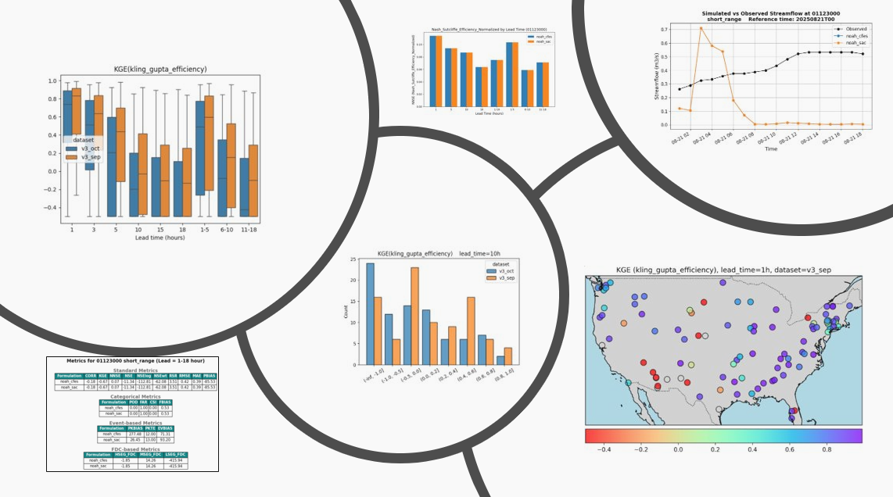

---
html_theme.sidebar_secondary.remove:
sd_hide_title: true
---

<!-- CSS overrides on the homepage only -->

(homepage)=
# NWM Evaluation Manager

# NWM Evaluation & Verification

`nwm-eval-mgr` is a repository of tools for evaluating and verifying NWM/NextGen simulations, hindcasts, and forecasts.
It supports data retrieval, forecast and observation pairing, metric computation, and visualization to assess model 
performance against observations and reference datasets. It is flexible and customizable, allowing users to adapt 
evaluation workflows to different datasets and use cases. It helps users understand model strengths and weaknesses, 
identify areas for improvement, and ultimately enhance the skill of hydrologic forecasts.

----

:::{toctree}
:maxdepth: 1
:hidden:

User Guide<user_guide.rst>
FAQ<faq.rst>
Configuration<config.md>
Technical Reference <tech_reference/index.md>
API </API/index.rst>
:::