.. _output-plots:
Output Plots
============================

``nwm-eval-mgr`` produces various plots to visualize the metric results from the evaluation and verification applications. 
Below are some sample plots as produced from running the sample configurations for the different forecast data sources 
(NWM/GCS, ngenCERF, hindcast, ngensim). The actual plots generated will depend on the configuration settings and the data used.

``NWM/GCS`` Forecast Verification Plots
-----------------------------------

Boxplots of Metrics by Lead Time
~~~~~~~~~~~~~~~~~~~~~~~~~~~~~~~~

Description: These boxplots display the distribution of metrics by lead time for the ``NWM/GCS`` forecast verification, 
across selected locations within the domain. Metric shown here is the Normalized NSE (NNSE), which is a normalized 
version of the Nash-Sutcliffe Efficiency (NSE) metric. Two different datasets are shown here for comparison: 
the NWMv3 short-range forecasts for October (``v3_oct``) and September (``v3_sep``).

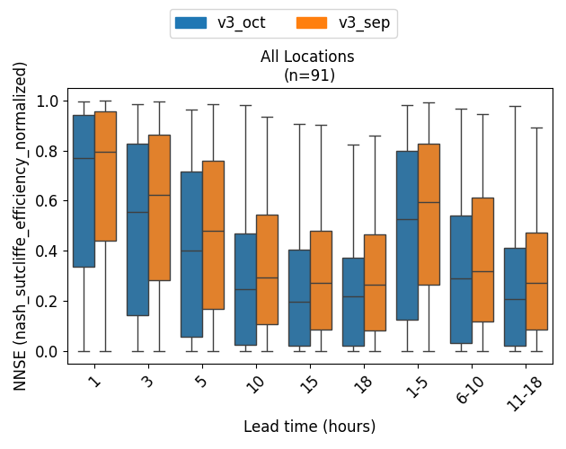

Histograms for a Specific Metric/Lead Time
~~~~~~~~~~~~~~~~~~~~~~~~~~~~~~~~~~~~~~~~~~~~~~~

Description: These histograms show the distribution of metrics for a specific lead time (e.g., 1-5 hour lead time) 
for the ``NWM/GCS`` forecast verification, across selected locations within the domain. Metric shown here is the 
Kling-Gupta Efficiency (KGE), which is a metric that combines correlation, bias, and variability.

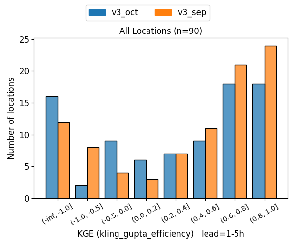

Spatial Map for a Specific Metric/Lead Time/Dataset
~~~~~~~~~~~~~~~~~~~~~~~~~~~~~~~~~~~~~~~~~~~~~~~~

Description: This spatial map visualizes the spatial distribution of a specific metric (e.g., KGE) for a specific lead 
time (e.g., 1 hour) and dataset (e.g., ``v3_oct``) at selected locations in the domain. The color of each point 
represents the metric score for that location, with a colorbar indicating the score range.

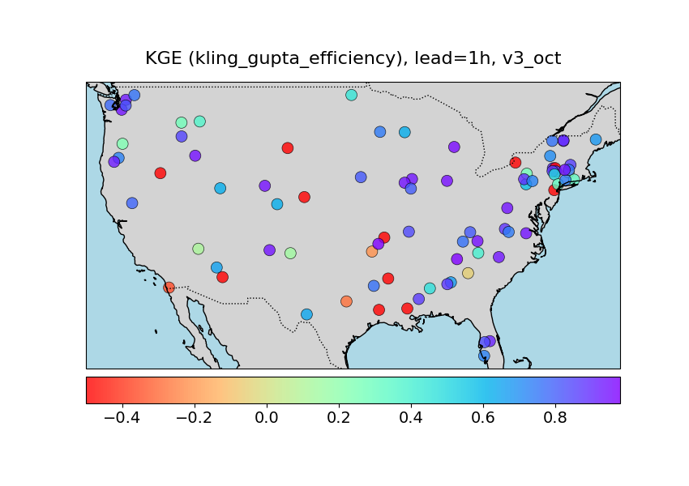

``ngenCERF`` Forecast Verification Plots
-----------------------------------

Barcharts of All Metrics
~~~~~~~~~~~~~~~~~~~~~~~
Description: These bar charts show the values of all computed metrics for ``ngenCERF`` forecast for a 
single location. Each bar represents a different metric, and the height of the bar indicates the metric score. 

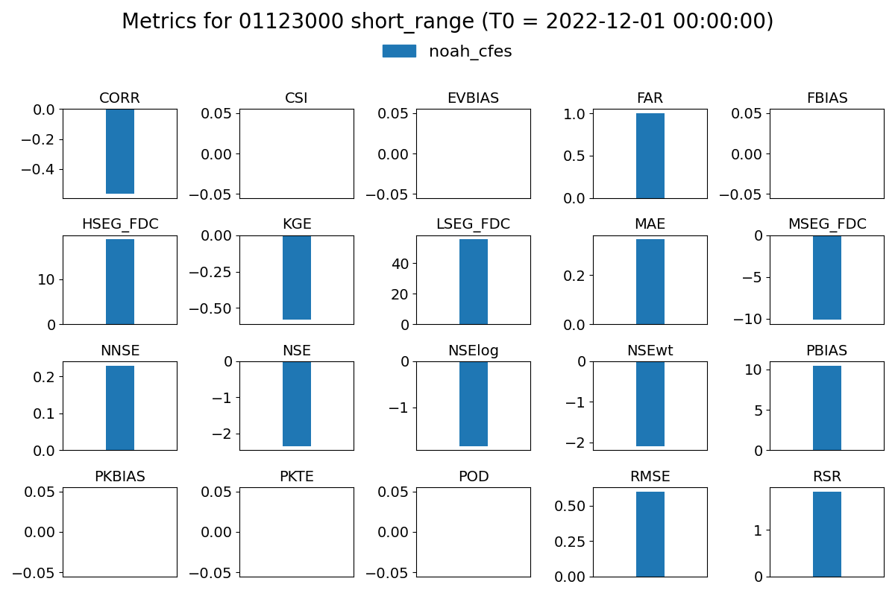

Time Series of Forecast vs. Observations
~~~~~~~~~~~~~~~~~~~~~~~~~~~~~~~~~~~~~~~
Description: These time series plots compare the forecasted streamflow values from ``ngenCERF`` forecasts with the 
observed streamflow values for a single location over the forecast window. The x-axis represents time (covering the 
forecast window), and the y-axis represents streamflow values. 

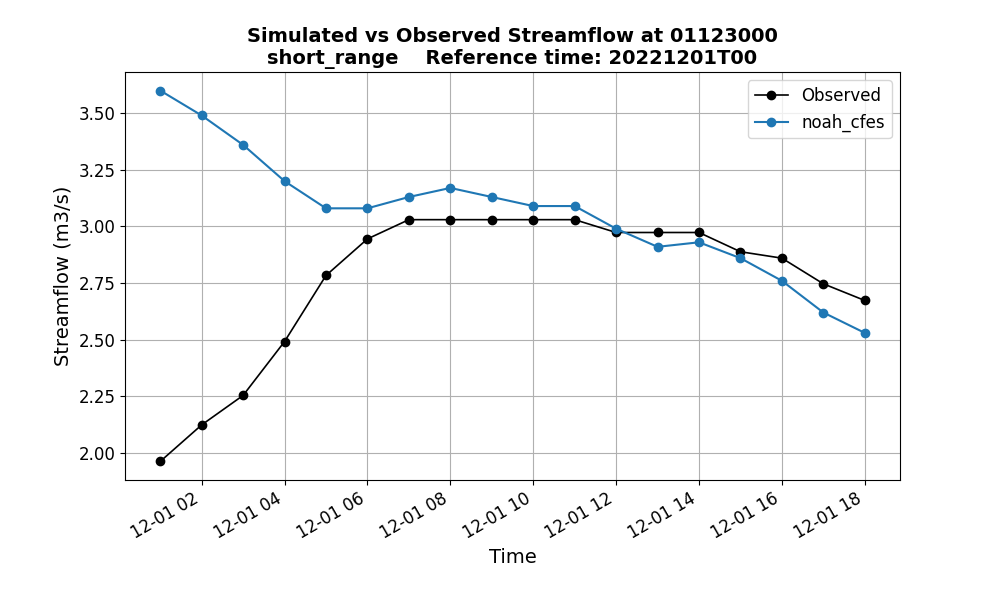

Metric Table of all Metrics
~~~~~~~~~~~~~~~~~~~~~~~~~~
Description: This metric table displays the values of all computed metrics for ``ngenCERF`` forecast for a single 
location. The metrics are grouped into four different categories: standard metrics, categorical metrics,
event-based metrics, and FDC-based metrics. 

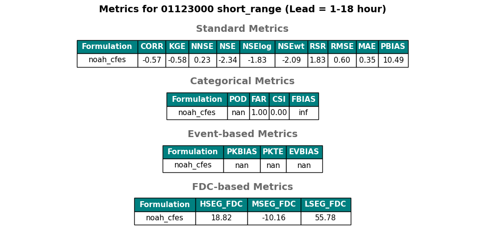

``hindcast`` Verification Plots
---------------------------

Barcharts of Metrics by Lead Time
~~~~~~~~~~~~~~~~~~~~~~~~~~~~~~~~
Description: These barcharts show how the values of a given metric change with lead time for a single location. 
Each group of bars represents a different lead time, and the height of each bar indicates the metric score.
Here the barcharts compares two datasets representing two different formualtions: ``noah_cfes`` and ``noah_sac``.

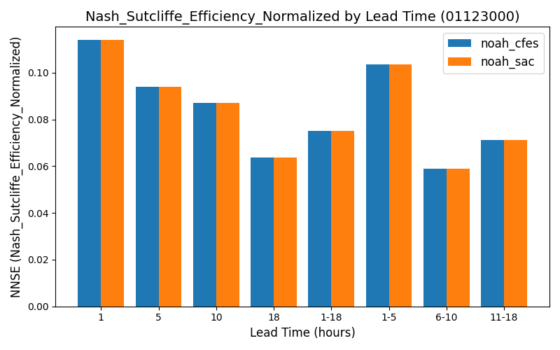

Time Series of Forecast vs. Observations for a Reference Time (T0)
~~~~~~~~~~~~~~~~~~~~~~~~~~~~~~~~~~~~~~~~~~~~~~~~~~~~~~~~~~~~~~~~~~~~~~~~
Description: These time series plots compare the forecasted streamflow values with the observed streamflow values for 
a single location and reference time (T0) over the forecast window. The x-axis represents time (covering the forecast 
window that varies with NWM configuration, e.g., 18 hours for short range), and the y-axis represents streamflow values. 
Here the time series compares two datasets: ``noah_cfes`` and ``noah_sac``.

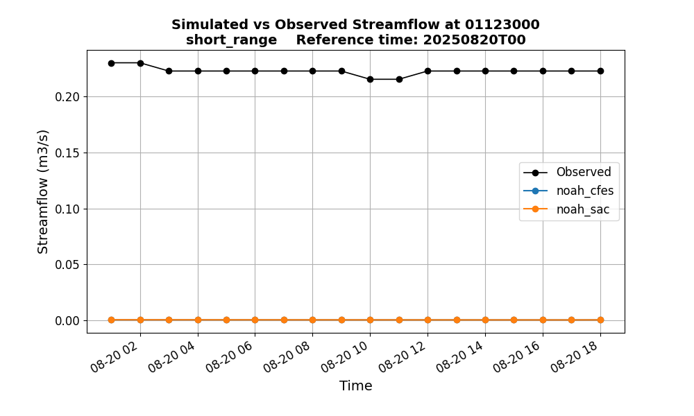

Time Series of Forecast vs. Observations for a Specific Lead Time
~~~~~~~~~~~~~~~~~~~~~~~~~~~~~~~~~~~~~~~~~~~~~~~~~~~~~~~~~~~~~~~~~~~~~~~~
Description: These time series plots compare the forecasted streamflow values with the observed streamflow values for 
a single location and lead time (e.g., 1-hour). The x-axis represents time (covering the hindcast time period,  
defined by ``general.forecast_start_time`` and ``general.forecast_end_time``), and the y-axis represents streamflow 
values. Here the time series compares two datasets: ``noah_cfes`` and ``noah_sac``.

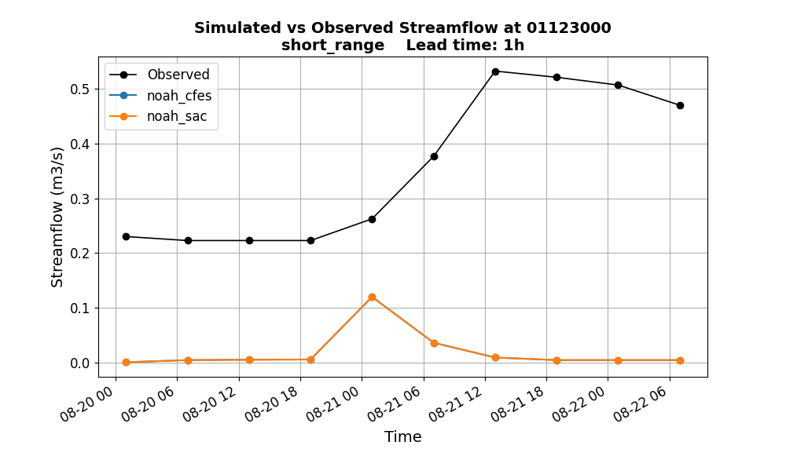

Metric Table of Selected Metrics for a Specific Lead Time
~~~~~~~~~~~~~~~~~~~~~~~~~~~~~~~~~~~~~~~~~~~~~~~~~~~~~~~~~~~~~~~~~~~~~~~~
Description: This metric table displays the values of selected metrics for a single location and lead time (e.g., 
lead time 1-18 hours). Here the table compares two datasets: ``noah_cfes`` and ``noah_sac``.

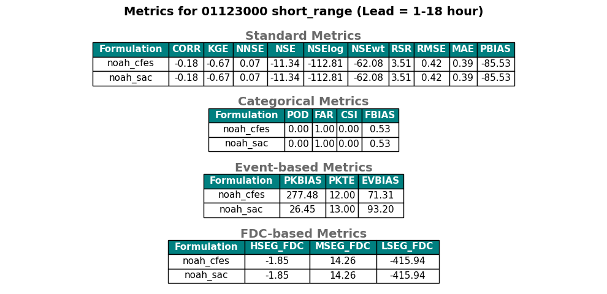

``ngenSIM`` Simulation Evaluation Plots
-----------------------------------

Boxplot of a Specific Metric
~~~~~~~~~~~~~~~~~~~~~~~~~~~~~~
Description: This boxplot shows the distribution of a specific metric (here ``NNSE``) for simulation evaluation, across 
selected locations within the domain. Here the boxplot compares two datasets representing two different regionalization 
algorithms: ``kmeans`` and ``gower``. The locations are divided into two groups: calibrated and non-calibrated basins.

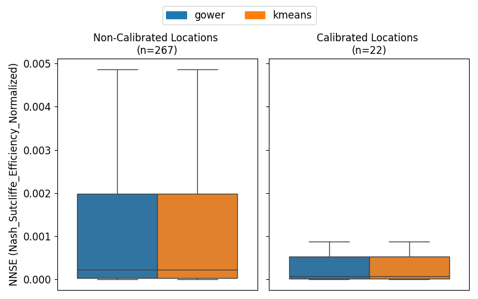

Histogram of a Specific Metric
~~~~~~~~~~~~~~~~~~~~~~~~~~~~~~~
Description: This histogram shows the distribution of a specific metric (here ``CORR``) for simulation evaluation 
across selected locations within the domain. Here the histogram compares two datasets representing two different 
regionalization algorithms: ``kmeans`` and ``gower``. The locations are divided into two groups: calibrated
and non-calibrated basins.

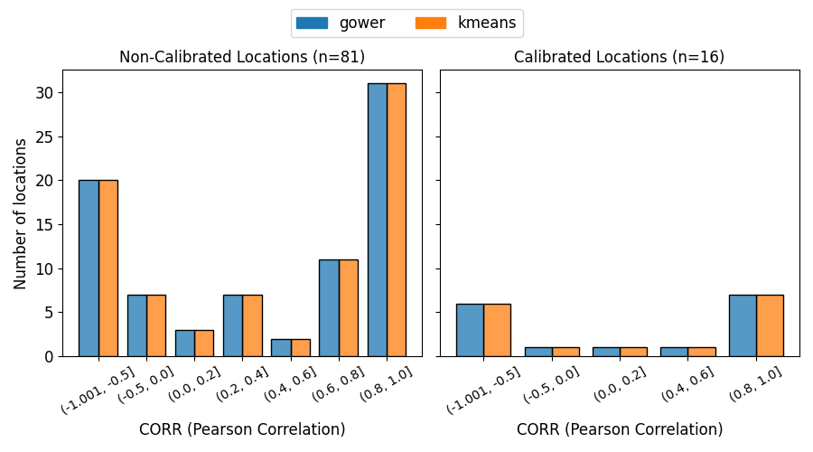

Spatial Map for a Specific Metric and Dataset
~~~~~~~~~~~~~~~~~~~~~~~~~~~~~~~~
Description: This spatial map visualizes the spatial distribution of a specific metric (here ``CORR``) for a specific 
dataset (here ``kmeans``) for simulation evaluation at selected locations in the domain. The color of each 
point represents the metric score for that location, with a colorbar indicating the score range. Calibrated and 
non-calibrated basins are shown in different symbols. 

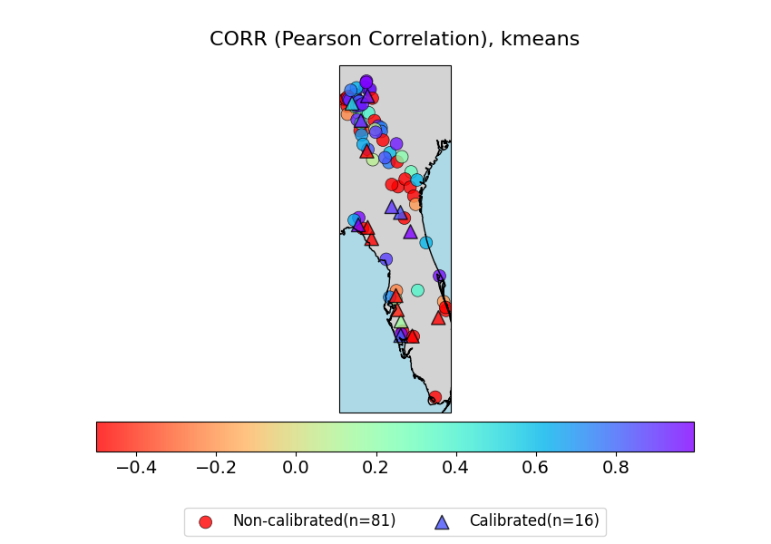