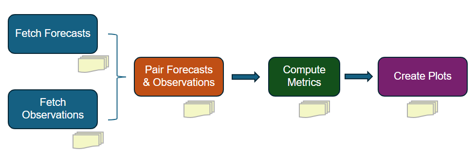

Workflow
========

Process
--------
The evaluation/verification process includes five main steps, as illustrated in the figure below. Each step produces 
outputs that are used in subsequent steps. The workflow is designed to be flexible and modular, allowing users to 
customize the evaluation process based on their specific needs and data availability.

   Steps in the verification workflow. Each step produces outputs that are used in subsequent steps. 

Steps
------
- Fetch Streamflow Forecast or Simulation Data
   In this step, model simulation data are retrieved from different sources as specified by ``nwm_forecast.data_source``
   in the YAML configuration file. Currently supported data sources include:

   - ngenCERF

      Streamflow simulations from a single forecast for a single location are retrieved from a csv output file produced 
      by running ngen with forecast forcing and a calibrated formulation. This evaluation mode is designed to facilitate 
      the formulation selection process.

   - ngenSIM

      Streamflow simulations for all gaged locations in a VPU are retrieved from a NetCDF output file produced by 
      running NGEN with historical forcing (e.g., AORC) and regionalized formulations over a VPU. 

   - hindcast

      Streamflow simulations from multiple forecasts for a single location are retrieved from csv output files produced 
      by running ngen with forecast forcing and a calibrated formulation. This evaluation mode is designed to facilitate 
      hindcast verification.

   - GCS

      Operational NWM streamflow forecast data are downloaded based on the specified configuration, 
      versions, and time periods defined in the YAML configuration file. The data are then extracted for the designated 
      locations. nwm-verf leverages the Python library 
      `TEEHR (Tools for Explanatory Evaluation in Hydrologic Research) <https://github.com/RTIInternational/teehr/>`_
      to retrieve operational NWM forecasts from Google Cloud Storage (GCS) and store them as Parquet files in the 
      TEEHR data model.

      ⚠️ This step can be highly resource-intensive and time-consuming. 

- Fetch Streamflow Observation Data
   In this step, streamflow observations are downloaded for the specified time periods and locations as defined in the 
   YAML configuration file. Currently, only USGS streamflow observations are supported.

- Pair Observations with Forecast/Simulation Data
   Next, streamflow forecasts are paired with corresponding observations based on validation time and location. This 
   step requires both forecast and observation datasets to be fully downloaded and processed in the preceding steps.

- Compute Evaluation Metrics
   After forecasts and observations are paired, performance evaluation metrics specified in the YAML configuration are
   computed. The calculations operate on the paired datasets generated in the previous step. Depending on the forecast 
   data source, metrics are computed differently with respect to lead time:

   - GCS / hindcast
      Metrics are computed separately for each lead time (including aggregated lead times, e.g., "1-5" hours) 
      according to the configuration.

   - ngenCERF
      Metrics are computed by aggregating across all lead times within the forecast window. That is, all forecast 
      values, regardless of lead time, are pooled to produce a single set of metrics.

   - ngenSIM
      Metrics are computed from simulation data pooled over the specified evaluation window (using a single lead time of 0 hours).

- Generate Visualization of Metrics
   In the final step, plots are created for the lead times and metrics specified in the YAML configuration file. 
   Depending on the selected forecast data source, different types of plots are generated to effectively visualize 
   the evaluation results:

   - GCS and ngenSIM (larger-scale analyses)
      - Spatial maps: displaying geographic patterns in forecast performance
      - Histograms: illustrating the distribution of metric values
      - Boxplots: summarizing metric variability across different conditions

   - ngenCERF (single-location analyses)
      - Time series: comparing time series of streamflow from NGEN forecasts and observations over the forecast window 
      - Bar chart: displaying various metric values as individual bar charts
      - Metric table: displaying metric values in tables, grouped by metric category

   - hindcast (single-location analyses with multiple forecasts)
      - Time series: comparing time series of streamflow from NGEN forecasts and observations for selected lead times and reference times (i.e., T0s) 
      - Bar chart: showing how metric values change with lead time across multiple forecasts
      - Metric table: displaying metric values in tables for selected lead times and metrics

Note: for a specifc evaluation run, certain steps may be skipped if the necessary outputs from those steps are already 
available from previous runs. For example, if you have already downloaded the necessary forecast and observation data, 
you can skip the first two steps and start directly from the pairing step. Similarly, if you have already computed the 
evaluation metrics, you can skip directly to the visualization step. This flexibility allows users to efficiently 
manage their evaluation workflow based on their specific needs and data availability.

Example Configuration:

.. code-block:: yaml

   general:   

      steps: # define which of the 5 steps to run; each step can be run independently,
         fetch_fcst_data: true
         fetch_obs_data: true
         pair_data: true
         compute_metrics: true
         plot_metrics: true

.. toctree::
   :maxdepth: 2
